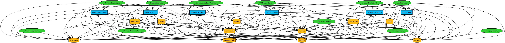

# Requirements

We need the following tools to complete installation:

-   Tuist
-   Swift Package Manager

### Tuist 3.25.0

If you don't have Tuist installed, you can do so by running the following command in your terminal:

```bash
curl -Ls https://install.tuist.io | bash
```

If you already have the tool, Make sure you're using Tuist version `3.25.0` by running:

```bash
tuist version
```

### Swift Package Manager 14.x

[SPM](https://www.swift.org/package-manager/) is a Package Manager that comes with Xcode. It is used for managing all of the project's external and internal dependencies generated by Tuist.

If you don't have Xcode installed, you can get it from the Apple App Store.

# Installation Guide

Follow these steps to install and set up the project:

1. Clone the repo:

```bash
git clone https://github.com/mohamadrezakoohkan/RandomUserClient.git
```

2. (Optional) Use Tuist to set the tool version:

```bash
tuist local 3.25.0
```

3. Fetch and build all external dependencies which is similar to `pod install`:
```bash
tuist fetch
```

4. Generate `RandomUserClient.xcworkspace`:

```bash
tuist generate
```

> this command will automatically open RandomUserClient.xcworkspace

5. Choose the `Boostrap` scheme from xcodeworkspace toolbar and build the project.

# General Details

This project is a client application based on [randomuser.me](https://randomuser.me/), a service that generates randomized user data. 

The project follows the MVI architecture (Model-View-Intent) as a unidirectional dataflow pattern and uses multiple Coordinators for handling navigation flow.

Archtiecture of this project is MVI as a Unidirectional dataflow and Coordinator for handling navigation flow. 

### Project Structure
- Store
    - State
    - Action
    - Effect
- Coordinator
    - View
    - Transition


### Technologies Used
- RxSwift for event-driven architecture
- UIKit for the UI layer
- CoreData for offline storage
- KingFisher for async image download task
- SwiftGen which comes with tuist for accessing project resources

